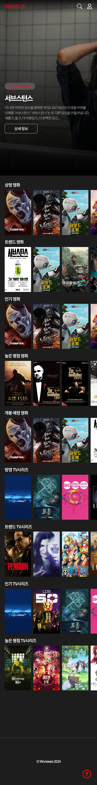
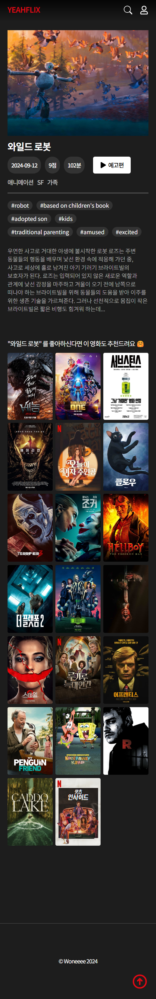
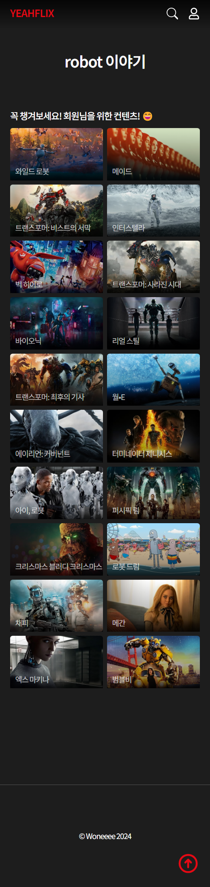
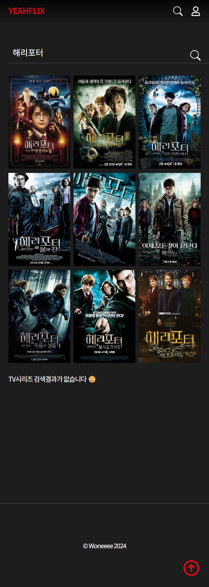
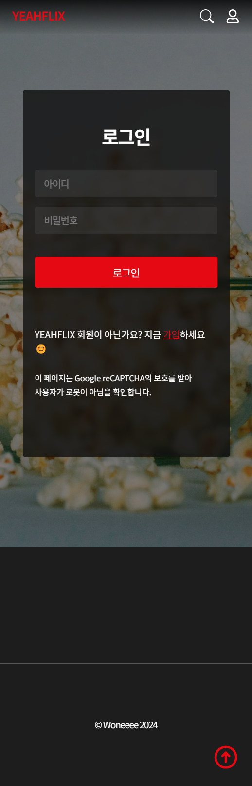

# YEAHFLIX | Movie Info & Recommandation App

## 목적성

- 요즘에는 저를 포함한 많은 사람들이 영화관에서 영화를 감상하는 것뿐만 아니라 'OTT 서비스' 를 제공하는 넷플릭스, 디즈니 플러스, 왓챠플레이 와 같은 플랫폼을 구독하여 더욱 영화를 쉽게 접근할 수 있는 것 같습니다.

- 저는 영화에 대한 접근성은 좋아졌지만 막상 영화를 감상하기에 앞서 항상 어떤것을 볼지의 난제에 빠지게 되는것 같다고 생각했습니다.

- 따라서, 저는 영화 소개 및 추천 어플리케이션이 있었으면 좋겠다고 생각을 했습니다. 최근 인기 및 트렌드 영화를 한 눈에 보며 새로운 정보를 얻고, 관련 영화 또는 줄거리의 키워드를 통한 비슷한 영화 추천을 받아 자신이 현재 보고싶은 영화가 무엇인지 찾는데에 더욱 유용하고 편리하게 사용할 수 있도록 하기위해 이 앱을 제작하게 되었습니다.

## Stack

  
   

- React
- html / css
- JS
- node.js
- git / github

## 개발기간 및 계획표

| 날짜 | 개발 내용                                   |
| ---- | ------------------------------------------- |
| 7/26 | 리서치, 기획, 계획표작성                    |
| 7/27 | 전체적 컴포넌트 구성, 홈제작                |
| 7/28 | 디테일페이지 (내용, 추천, 키워드 기능 추가) |
| 7/29 | 디테일 (예고편 추가), 서치페이지 제작       |
| 7/30 | 로그인, 회원가입 페이지 제작                |
| 7/31 | tv시리즈 구성                               |
| 8/1  | 반응형, 유지보수 및 리팩토링                |
| 8/2  | 배포                                        |

## 프로젝트 소개 및 Url

- Github Url - https://github.com/Woneeee/movie_review_app
- Project Url - https://woneeee.github.io/movie_review_app/

- Open Api Url

  - TMDB - https://www.themoviedb.org/?language=ko

- 모바일 이미지

  
  
  
  
  

## 프로젝트를 하며 느낀점

### 프로젝트 진행 중 겪은 어려움

1.  저는 영화의 정보를 소개하는 페이지에서 유튜브영상을 예고편으로 사용하여 예고편 재생버튼을 누르면 모달창이 생성되어 영상을 재생할 수 있고 닫기버튼을 누르면 영상이 사라지도록 만들었습니다. 그러나 영상닫기 버튼을 클릭할때 예고편 화면은 사라지지만 소리가 계속 나오는 문제가 발생하여 그것을 해결하는데 어려움이 있었습니다. 따라서 유튜브 영상을 마음대로 멈출 수 있는 방법을 찾고자 고민을 하는데 많은 시간을 지체한 것 같습니다.

2.  저는 회원가입, 로그인, 로그아웃 기능을 비슷하게 구현해보고자 하였습니다. 그래서 form, input 태그를 이용하여 사용자가 입력한 값을 받아오도록 회원가입을 구현했습니다. 그러나 사용자 입력값을 바탕으로 로그인까지 하려면 데이터를 저장할 공간이 필요했고 그것을 찾는데에 어려움이 있었습니다.

### 어려움을 해결한 방안

1. 위에서 언급했듯 예고편 영상 닫기 버튼을 누르면 영상 소리가 멈추게 할 방법을 찾기위해 구글링을 많이 했습니다. 구글링을 하며 유튜브 player Api 자체에 영상을 중지시키며 끝나는 시간을 시간을 설정할 수 있는 매개변수가 있다는것을 알게되었습니다. 따라서 'end'라는 매개변수를 통해서 닫기버튼을 누르면 더 이상 소리가 계속 나오지 않고 중지되게 만들 수 있었습니다. 그러나 끝나는 시간을 제가 1초로 정했기 때문에 예고편재생버튼을 다시 눌렀을때 1초부터 영상을 시청해야하는 문제가 발생하였습니다. 따라서 setTimeout 함수를 이용해 다시 end매개변수가 없을때처럼 초기화하여 영상을 재상 닫기 버튼을 통해 매끄럽게 볼 수 있도록 해결하였습니다.

2. 위의 겪은 어려움 2번과 같은 맥락으로 데이터를 저장할 공간을 찾다가 localStorage 라는 것을 발견하게 되었고 setItem 함수를 통해 회원가입때 입력한 값을 localStorage에 저장하였습니다. 그리고 getItem 함수를 통해 이미 저장된 값과 로그인때 입력한 값이 일치하면 로그인이 되었다는 표시와함께 메인페이지로 이동이 가능하게 만들 수 있었습니다. 그러나 로그인이 된 후 헤더의 로그인 아이콘이 로그아웃으로 변경될 수 있게 만드는 과정에서 또 한번의 어려움을 겪었습니다. 따라서 useState 를 활용해 isLogin 이 초기에는 false가 되도록 설정해두고 localStorage에 값이 들어오면 isLogin을 true로 만들어 로그인여부를 알 수 있게 만들었고 로그인 여부에 따라 결과적으로 아이콘이 변경되도록 만들 수 있었습니다.

## 프로젝트를 하면서 알게된 내용

- 이번 프로젝트에서 로그인 회원가입 시스템에 굉장히 고심을 많이 하며 localStorage와 setItem, getItem, removeItem 함수를 사용해보는 경험을 하게 되었고 로그인후 헤더에 로그아웃 아이콘이 생성되는 과정에서 어려움이 있었는데 그것또한 localStarage의 값과 useState Hook 을 활용하여 로그인 여부를 판별하게만들 수 있다는 것을 알게되었습니다. 따라서 다음 프로젝트에서는 고민과 시간을 쏟은만큼 이 부분에 대해서 조금더 수월하게 진행 할 수 있겠다는 자신감을 얻었습니다.

- 그리고 iframe을 통하여 유튜브 영상으로 예고편을 제작하고 예고편 재생 버튼과 닫기 버튼을 통해 컨트롤 할 수 있게 제작하는 과정도 많은 고심을 해 만들었기 때문에 비디오를 삽입하는 것 또한 알게되었습니다.

- 마지막으로 이미지 위에 글자를 넣을때에는 이미지 위에 그라디언트나, 투명도, backdrop-filter를 통해 블러처리한 막을 하나를 생성하여 글자가 잘 보이도록 제작하는 것이 좋다는것을 공부하게 되었습니다.

## 프로젝트 진행중 칭찬 및 반성

- 칭찬: 생각보다 짧은시간안에 기획부터 개발까지 앱을 만드는것이 쉽지 않았는데 계획표에 맞춰 잘 진행했다는 생각에 뿌듯했습니다. 또한 생각한 기능을 넣기 위해 계속 '이렇게 하면 될까'를 굉장히 많이 고민했고 어렵다고 느낀 부분에 대해서도 끝까지 포기하지 않고 해결하려 노력하고 결국 해결을 했을때 굉장히 성취감이 느껴지는 시간이었습니다.

- 반성: 이번 프로젝트에서는 api 를 사용하는법과 유튜브 영상을 예고편으로 쓰기, 로그인 및 로그아웃 기능 등 처음 추가해보는 기능에 많은 시간을 쓴것 같습니다. 따라서 많은 디자인 레퍼런스를 볼 시간이 조금 부족하여 다소 밋밋한 디자인적인 결과물이 나온것 같아 조금 아쉽다는 생각이 들었습니다. 다음 프로젝트에서는 이에 대한 부분을 좀 개선하고자 더 많은 레퍼런스를 사전에 찾아보아야 할 것 같습니다.

## 앞으로의 개발 방향

- 프로젝트를 진행하기에 앞서 주제, 디자인, 기능, 사용할 데이터의 종류, 사이트맵 등을 기획하며 구체화하기

- 유저입장에서 사용했을때 불편할 수 있는 사항들이 있기에 제작후 지속적으로 UIUX가 괜찮은지를 검토하고 수정해 나가기

- 모바일 반응형 까지도 미리 처음부터 고려해서 제작하기

- 새롭게 알아낸것을 일회성으로 끝내는 것이 아니라 정리를 하고 프로젝트에 직접 사용해 보며 익히기
